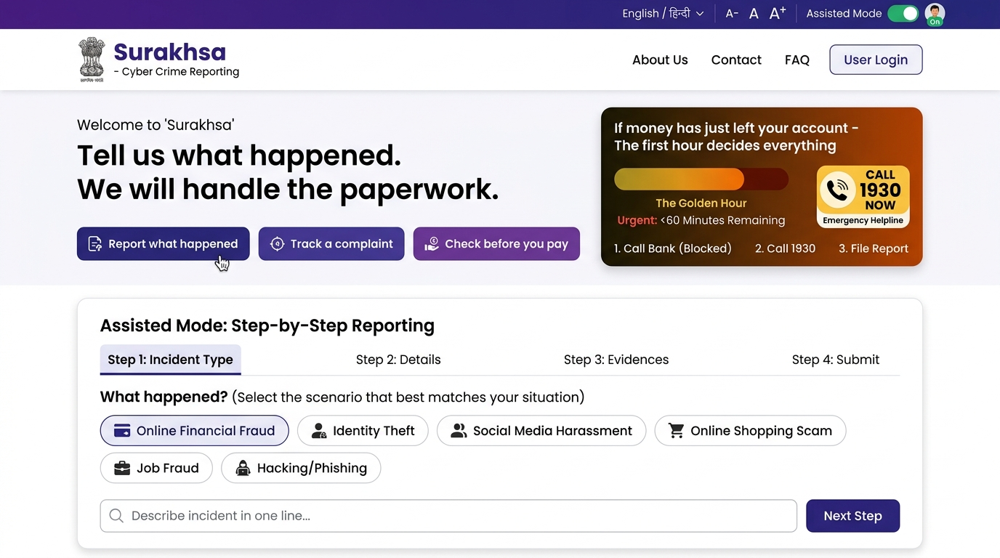

# Surakhsa — Cyber Crime Reporting Portal

An accessible, rapid-action citizen portal redesign for reporting cyber crimes in India, based on the **UX4G Design System** and built on **Next.js App Router** with a **MongoDB** persistence layer.



> [!WARNING]
> **Independent hackathon prototype.** This project is not affiliated with, endorsed by, or connected to the Government of India, the Ministry of Home Affairs, or I4C. In a real emergency, dial **1930** or visit [cybercrime.gov.in](https://cybercrime.gov.in/).

---

## 1. Summary of Changes: What Was Broken vs. What Was Fixed

| Component / Area | Initial Cloned State | Fixed & Implemented State |
| :--- | :--- | :--- |
| **Top Bar Controls** | Static buttons with no event handlers (`aria-pressed="false"` hardcoded, dead language button, static text size controls). | Fully functional: Assisted mode toggle, Language selector dropdown (6 Indian languages), immediate text scaling (`A-`, `A`, `A+`), and auth entry point. |
| **Assisted Mode** | Visual button only, no actual step-by-step or questionnaire flow. | Complete 5-step MCQ guided questionnaire (`g.q1` through `g.q5`), voice read-aloud via Web Speech API, sentence chunking, dynamic high-contrast large-font UI styling (`html[data-assist="on"]`), and mode switching banner. |
| **Authentication** | Missing sign-in links or non-functional routes. | Complete end-to-end phone number entry (`/signin`), deterministic simulated OTP generator with 1-click test fill, secure session cookies, MongoDB session tracking, and masked phone display (`98xxxxx210`) with sign-out. |
| **Reporting Flow** | Basic static form or dummy inputs with no category mapping or banking freeze integration. | Intelligent multi-step state machine: Guided MCQ or multilingual free-text input with speech recognition, automatic NCRP cybercrime classification (30 official categories), Golden-Hour banking freeze form (6 key fields), client-side SHA-256 evidence hashing, and submission into MongoDB. |
| **Complaint Tracking** | In-memory or dummy view with no database search. | Real data-driven tracking via Acknowledgement Number (`ACK-YYYY-XXXXXX`) queried directly from MongoDB `complaints` collection, Right to Service statutory SLA timeline calculation, and verified user complaint history. |
| **Suspect Check** | Static placeholder without database storage or reporting. | Real-time string analysis for phishing domains (punycode, fake bank subdomains), suspicious UPI VPAs, and international phone numbers. Suspect check logs and citizen suspect reports persisted in MongoDB with `SUS-XXXXXX` references. |
| **Database & Persistence** | In-memory or SQLite dependencies. | 100% native **MongoDB** persistence using the official MongoDB driver with connection pooling. Inspectable using **MongoDB Compass**. |

---

## 2. Architecture & Backend Design

### MongoDB Setup
The backend connects to MongoDB using the official Node driver with connection pooling and singleton caching for development hot-reloading:

- **Default Local MongoDB URI**: `mongodb://127.0.0.1:27017/surakhsa`
- **Cloud / Production MongoDB URI**: `mongodb+srv://<user>:<password>@cluster0.mongodb.net/surakhsa?retryWrites=true&w=majority`
- **Database Name**: `surakhsa`

### Collections Schema:
1. **`users`**:
   - `phone` (string, unique)
   - `createdAt` (date)
   - `lastLoginAt` (date)
2. **`sessions`**:
   - `token` (string, secure 32-byte hex)
   - `phone` (string)
   - `createdAt` (date)
   - `expiresAt` (date, 30-day sliding expiry)
3. **`complaints`**:
   - `ack` (string, e.g. `ACK-2026-481902`)
   - `phone` (optional string, linked if citizen signed in)
   - `categoryId` & `categoryLabel` (official NCRP category)
   - `parentCategory` ("Financial Fraud" | "Women/Children" | "Other Cyber Crime")
   - `urgency` ("golden-hour" | "urgent" | "standard")
   - `narrative` (plain language incident description)
   - `amount` (numeric loss in INR)
   - `bankName`, `bankAccount`, `transactionId`
   - `freezeRequested` (boolean)
   - `stage` (numeric 1-5 case stage)
   - `createdAt` (timestamp)
   - `evidenceFiles` (`[{ name, size, sha256 }]`)
4. **`complaint_drafts`**:
   - `draftId` (string)
   - `phone` (optional string)
   - `step` (string)
   - `data` (object)
   - `updatedAt` (timestamp)
5. **`suspect_checks`**:
   - `query` (string)
   - `kind` ("url" | "upi" | "phone" | "email")
   - `verdict` ("danger" | "warning" | "ok" | "unclear")
   - `reasons` (string array)
   - `checkedAt` (timestamp)
6. **`suspect_reports`**:
   - `ref` (string, e.g. `SUS-192841`)
   - `suspectValue` (string)
   - `reason` (string)
   - `phone` (optional string)
   - `createdAt` (timestamp)
7. **`settings`**:
   - `key` (string)
   - `value` (any)
   - `updatedAt` (timestamp)

---

## 3. MongoDB Compass Usage Guide

You can inspect, query, and verify the backend data directly in **MongoDB Compass**:

1. Launch **MongoDB Compass**.
2. Connect to the connection string:
   ```text
   mongodb://localhost:27017
   ```
   *(or your MongoDB Atlas connection string)*.
3. In the left database navigation pane, select the **`surakhsa`** database.
4. You will see the collections:
   - Click **`complaints`** to view all filed cybercrime reports, their assigned ACK numbers, amounts, and audit timestamps.
   - Click **`users`** and **`sessions`** to verify active user login states and tokens.
   - Click **`suspect_checks`** and **`suspect_reports`** to inspect analyzed URLs, UPI IDs, and citizen suspect submissions.

---

## 4. Top Bar Controls & Preferences Persistence

- **Assisted Mode**:
  - Toggled from the top bar button or landing page banner.
  - Sets `<html data-assist="on">` and stores preference in `localStorage` under `surakhsa.assist.v1`.
  - Automatically scales touch targets (`min-height: 54px`), enlarges typography (20px body font, 1.7 line-height), activates high-contrast focus rings, and switches `/report` to the 5-step MCQ questionnaire.
- **Language Selector**:
  - Supports: **English**, **हिन्दी** (Hindi), **বাংলা** (Bengali), **मराठी** (Marathi), **தமிழ்** (Tamil), and **తెలుగు** (Telugu).
  - Persisted in `localStorage` under `surakhsa.lang.v1` and sets `<html lang="...">`.
  - Backed by an authentic dictionary of extracted translations (`src/lib/i18n.ts`).
- **Text Size**:
  - `A-` (Small, 14px), `A` (Base, 16px), `A+` (Large, 18px).
  - Persisted in `localStorage` under `surakhsa.textsize.v1` and sets `<html data-textsize="...">`.
- **Authentication Header State**:
  - When logged out: shows `Sign in` linking to `/signin`.
  - When logged in: displays masked mobile number (e.g. `98xxxxx210`) with an immediate `Sign out` action.

---

## 5. Reporting Journey & Assisted Mode Flow

The citizen reporting journey supports two interchangeable modes:

### A. Assisted Mode (Questionnaire Flow)
1. **Question 1 (Contact Channel)**: Phone call, WhatsApp/SMS, Social media, Email, Website/app, In person.
2. **Question 2 (What happened)**: Shared OTP/PIN, Installed app, Clicked link & entered bank details, Transferred money, Threatening with private photos, Nothing yet.
3. **Question 3 (Money Movement)**: Yes / No. If Yes, requests approximate amount with rupee formatting (`₹ 50,000`).
4. **Question 4 (Timing)**: In the last hour, Earlier today, In the last few days, More than a week ago.
5. **Question 5 (Additional details)**: Optional open text field.
6. **Summary & Read Aloud**: Synthesizes a structured incident narrative with one-click **Read Aloud** speech narration (`SpeechSynthesis`).
7. **Confirmation**: Sends the synthesized statement to the official triage classifier.

### B. Standard Mode
- Free-text textarea supporting English, Hindi, and Hinglish.
- Native speech-to-text voice input via browser SpeechRecognition.
- Quick test templates: "UPI fraud", "Hinglish", "Impersonation".

### Downstream Steps (Both Flows):
- **Triage & Classification**: Rule-based matching against official Indian NCRP categories (UPI Fraud, Phishing, Investment Scam, Task Scam, Sextortion, etc.) with category override capabilities.
- **Golden-Hour Bank Freeze**: Captures the essential 6 bank routing fields (Citizen bank/app, Debited account/UPI, Suspect account/UPI, Transaction UTR, Amount) and simulates immediate CFCFRMS network transmission.
- **Evidence Verification**: Calculates real cryptographic SHA-256 hashes for all uploaded evidence attachments in the browser using the Web Crypto API (`window.crypto.subtle.digest`).
- **Acknowledgement**: Submits to MongoDB and returns an official Acknowledgement Number (e.g. `ACK-2026-481902`).

---

## 6. Complaint Tracking Flow (`/track`)

- **Search by ACK Number**: Enter any valid Acknowledgement Number to retrieve stored records from MongoDB.
- **Right to Service Act Statutory SLA**: Displays calculated remaining days (15-day statutory SLA) and current handling cyber unit.
- **Data-Driven Timeline**: Shows progression through Complaint Registration, Banking Freeze hold, Investigating Officer assignment, and Final Resolution.
- **Citizen Dashboard**: When logged in, automatically queries and displays all complaints filed by the citizen's mobile number.

---

## 7. Suspect Repository (`/check`)

- **Instant Pattern Analysis**:
  - Deceptive UPI handles (e.g. `refund`, `support` keywords).
  - Phishing & Homograph URL attacks (`xn--` punycode detection, bank typosquatting, brand-in-subdomain).
  - High-risk international calling prefixes (`+92`, `+234`, `+1876`).
- **Suspect Reporting**: Submit suspect identifiers and incident reasons to the national repository in MongoDB with an official `SUS-XXXXXX` reference number.

---

## 8. What Remains Simulated

To ensure complete transparency (consistent with the prototype's `/about` page):
- **SMS Delivery**: OTP generation is deterministic and printed on-screen for frictionless demonstration testing. No paid telecom SMS gateway is connected.
- **Bank Payment Network**: Bank freeze requests simulate the CFCFRMS / 1930 routing protocol with real timeouts and status tracking, but no live banking core switches are contacted.
- **Evidence Files**: Files are hashed on the client using real SHA-256 cryptography to demonstrate chain-of-custody integrity, but heavy binary file uploads are not transferred to an external S3 bucket.

---

## 9. Deployment Guide (Vercel)

The repository has been structured and sanitized so it builds and runs smoothly on **Vercel**.

### Step 1: Set Up MongoDB Atlas (Free Cloud Database)
Because Vercel serverless functions cannot connect to `localhost:27017`, you need a cloud MongoDB connection string:
1. Go to [MongoDB Atlas](https://www.mongodb.com/cloud/atlas) and create a free Shared Cluster (M0).
2. Under **Database Access**, create a database user and password.
3. Under **Network Access**, add `0.0.0.0/0` (Allow access from anywhere) so Vercel serverless functions can connect.
4. Click **Connect** > **Drivers** to copy your connection string:
   ```text
   mongodb+srv://<username>:<password>@cluster0.xxxxxx.mongodb.net/surakhsa?retryWrites=true&w=majority
   ```

### Step 2: Configure Environment Variables in Vercel
In your Vercel project dashboard:
1. Navigate to **Settings** > **Environment Variables**.
2. Add the following variables:
   - `MONGODB_URI`: Your MongoDB Atlas connection string from Step 1.
   - `MONGODB_DB`: `Saarthi` (or your preferred database name).
   - `JWT_SECRET`: Any random secure secret key (e.g. `surakhsa_super_secret_jwt_key_2026`).
   - `NEXT_PUBLIC_APP_URL`: Your Vercel deployment URL (e.g. `https://casepath-two.vercel.app`).
3. Click **Save** and trigger a **Redeploy** on your latest deployment.

### Step 3: Verify Stored Complaints in MongoDB Atlas
To verify that complaints submitted from either local or Vercel are safely stored in your cloud MongoDB database, run:

```bash
npm run db:check
```

---

## 10. Local Development

### 1. Start Local App
```bash
npm install
npm run dev
```
Open [http://localhost:3000](http://localhost:3000).

### 2. Verify Database Connection
```bash
npm run db:check
```
This connects to your configured MongoDB database, validates schema collections, and displays the latest stored complaint records.
