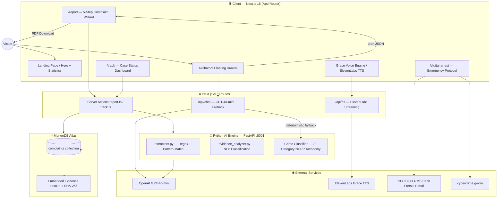
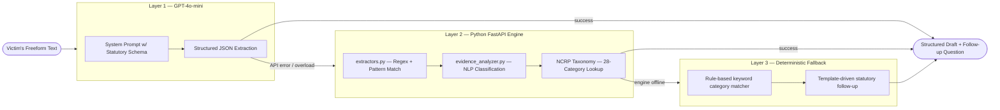
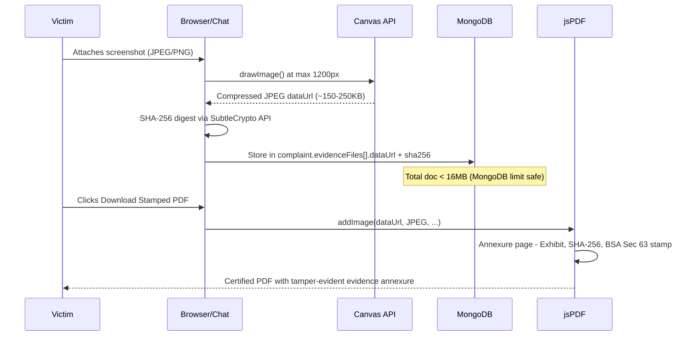
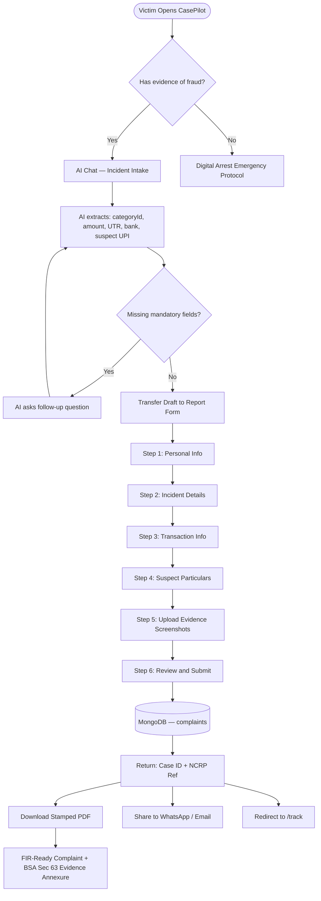
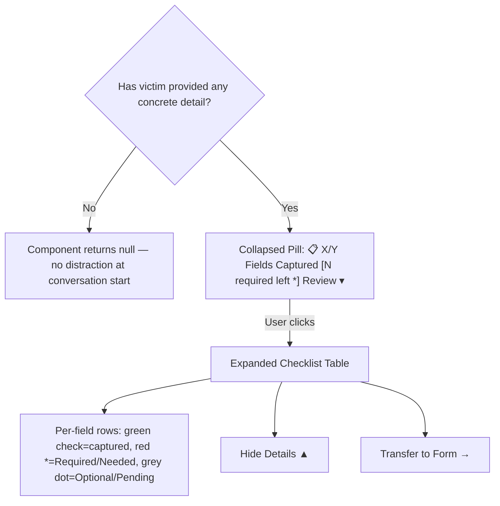

<div align="center">

# 🛡️ CasePilot — Citizen Cyber Triage & Incident Routing

**AI-Powered Cyber Crime First Response Platform for India**

[](https://nextjs.org)
[](https://python.org)
[](https://mongodb.com)
[](https://fastapi.tiangolo.com)
[](https://openai.com)
[](LICENSE)

> **CasePilot** is India's first AI-first cyber incident triage platform — built to guide victims from the moment of fraud to a filed NCRP complaint, with real-time bank freeze routing, statutory evidence packaging, and a 28-category crime taxonomy mapped to BNS, BNSS, IT Act, and BSA legal frameworks.

[🚀 Quick Start](#-quick-start) · [📖 Architecture](#️-system-architecture) · [⚖️ Legal Framework](#️-legal-framework) · [🤖 AI Pipeline](#-ai-pipeline)

---

</div>

## 📌 Problem Statement

Every 10 minutes, an Indian citizen loses money to cyber fraud. The average victim:

1. **Doesn't know** which authority to call (1930 vs. local police vs. cyber cell)
2. **Loses the 120-minute Golden Hour** — the window within which banks can freeze funds before they are mule-hopped offshore
3. **Cannot articulate** the technical details an FIR needs: UTR number, suspect UPI, payment mode, blockchain TxID
4. **Never files** a formal NCRP complaint because the government portal is confusing

**CasePilot collapses that entire journey** — from panic-stricken victim to a legally-admissible FIR-ready complaint — into a 3-minute AI-guided conversation.

---

## 🏗️ System Architecture



---

## 🤖 AI Pipeline

The platform runs a **three-layer AI cascade** — ensuring robust extraction even when the primary LLM is unavailable.



### AI Chat System Prompt Architecture

The `REPORTING_SYSTEM_PROMPT` in [`/api/chat/route.ts`](src/app/api/chat/route.ts) enforces:

| Directive | Description |
|-----------|-------------|
| **MANDATORY STATUTORY FIELDS** | Per crime pillar — must ask for starred fields before proceeding |
| **One Question Per Turn** | Prevents overwhelming victims |
| **Golden Hour Priority** | Immediately asks for UTR / bank if < 2 hours elapsed |
| **Language Adaptivity** | Detects Hinglish / regional language and responds in kind |
| **Mandatory JSON Output** | Every reply includes a `draft` JSON payload with extracted fields |
| **Active Follow-Up** | Bot must ask for the top missing `*` mandatory field in every reply |

---

## 🗂️ 28-Category NCRP Crime Taxonomy

```mermaid
stateDiagram-v2
    [*] --> FINANCIAL_FRAUD
    [*] --> WOMEN_CHILDREN
    [*] --> OTHER_CYBER_CRIME

    FINANCIAL_FRAUD --> UPI_FRAUD
    FINANCIAL_FRAUD --> INVESTMENT_FRAUD
    FINANCIAL_FRAUD --> LOAN_APP_FRAUD
    FINANCIAL_FRAUD --> OTP_FRAUD
    FINANCIAL_FRAUD --> IMPERSONATION_GOVT
    FINANCIAL_FRAUD --> COURIER_SCAM
    FINANCIAL_FRAUD --> JOB_TASK_FRAUD
    FINANCIAL_FRAUD --> BUSINESS_EMAIL_COMPROMISE

    WOMEN_CHILDREN --> CHILD_SEXUAL_ABUSE_MATERIAL
    WOMEN_CHILDREN --> SEXTORTION
    WOMEN_CHILDREN --> ONLINE_BLACKMAIL
    WOMEN_CHILDREN --> CYBER_STALKING
    WOMEN_CHILDREN --> DEFAMATION

    OTHER_CYBER_CRIME --> CRYPTOCURRENCY_FRAUD
    OTHER_CYBER_CRIME --> RANSOMWARE
    OTHER_CYBER_CRIME --> HACKING_DATA_BREACH
    OTHER_CYBER_CRIME --> WEBSITE_DEFACEMENT
    OTHER_CYBER_CRIME --> SOCIAL_MEDIA_ACCOUNT_TAKEOVER
    OTHER_CYBER_CRIME --> ONLINE_IMPERSONATION
    OTHER_CYBER_CRIME --> VISHING_SMISHING
    OTHER_CYBER_CRIME --> MALICIOUS_APK
    OTHER_CYBER_CRIME --> SIM_SWAP
    OTHER_CYBER_CRIME --> AADHAAR_MISUSE
    OTHER_CYBER_CRIME --> DIGITAL_ARREST
    OTHER_CYBER_CRIME --> DARK_WEB
    OTHER_CYBER_CRIME --> ATM_SKIMMING
    OTHER_CYBER_CRIME --> GAMING_FRAUD
```



---

## 📋 Statutory Mandatory Fields per Crime Pillar

| Crime Pillar | Mandatory Fields (`*`) | Optional Fields |
|---|---|---|
| **Financial Fraud** (UPI, OTP, Investment) | Incident Date/Time `*`, Bank Name `*`, Amount `*`, Payment Mode `*`, 12-Digit UTR `*`, Suspect UPI/Account `*` | Victim Account, Channel/App |
| **Cryptocurrency Fraud** | Incident Date/Time `*`, Blockchain Network `*`, Transaction Hash (TxID) `*`, Suspect Wallet `*`, Estimated Loss `*` | Victim Wallet, Exchange Used |
| **Ransomware / Hacking** | Incident Date/Time `*`, Target Domain / Server IP `*`, Encrypted Extension `*` | Ransom Contact/Wallet, Defacer Handle |
| **Social Media / Impersonation** | Incident Date/Time `*`, Platform `*`, Imposter Profile URL `*` | Genuine Profile URL, Victim count |
| **Women & Children** | Incident Date/Time `*`, Intimidation/Extortion Details `*`, Suspect Contact/Handle `*` | Reporting Track (anonymous option) |

---

## 🖼️ Evidence Image Vault



### Evidence Schema

```typescript
evidenceFiles: Array<{
  name: string;       // original filename
  size: number;       // original bytes
  sha256: string;     // browser-computed SHA-256 hex digest
  category?: string;  // e.g. "screenshot" | "transaction_receipt"
  dataUrl?: string;   // compressed JPEG base64 (~150-250KB each)
}>
```

### Why MongoDB (No S3)?

- Canvas downscaling to max 1200px keeps each screenshot at **~150–250 KB**
- A complaint with 3 screenshots = **< 1 MB** — well within MongoDB's **16 MB** document limit
- Eliminates external dependency (no S3 bucket, no presigned URLs, no CDN)
- Images are **embedded in jsPDF** directly for the Annexure page — no extra download step

---

## 🔄 Complaint Submission Flow



---

## ⚖️ Legal Framework

| Statute | Sections | Purpose |
|---|---|---|
| **BNS 2023** | §111 organised crime, §308 extortion, §318 cheating, §351 criminal intimidation | Crime severity classification, FIR category labelling |
| **BNSS 2023** | §173(3) zero FIR, §503 restitution, §91/94 telecom CDR tracing | Zero FIR rights; amount field for restitution; UTR for CDR order |
| **IT Act 2000** | §43 damage to computer, §66 hacking, §66C identity theft, §66D impersonation, §67/67B obscene material | Overlay on crime type badge in complaint summary |
| **BSA 2023** | §63 digital evidence admissibility | SHA-256 hash + certified annexure makes evidence admissible in court |
| **IT Rules 2021** | Rule 3(2)(b) — 24-hour takedown for impersonation | URL captured for grievance; instructions shown for social media crimes |
| **RBI Master Direction** | Chargeback timelines, dispute windows | Displayed in bank freeze guidance and Golden Hour countdown |

---

## 🏗️ Project Structure

```
fraud-case-tracker/
├── src/
│   ├── app/
│   │   ├── page.tsx                    # Landing page with hero and statistics
│   │   ├── report/page.tsx             # 5-step complaint wizard
│   │   ├── track/page.tsx              # Case tracking dashboard
│   │   ├── digital-arrest/page.tsx     # Emergency digital arrest protocol
│   │   └── api/
│   │       ├── chat/route.ts           # GPT-4o-mini chat + fallback engine
│   │       └── tts/route.ts            # ElevenLabs TTS proxy
│   ├── actions/
│   │   ├── report.ts                   # MongoDB write — create complaint
│   │   └── track.ts                    # MongoDB read — get complaint by ID
│   ├── components/
│   │   ├── chat/AIChatbot.tsx          # Floating drawer + IntakeChecklistTable
│   │   └── layout/Header.tsx           # Nav with i18n + accessibility
│   ├── context/
│   │   ├── AssistContext.tsx           # Screen reader / voice assistance context
│   │   └── LanguageContext.tsx         # Hindi / English i18n context
│   └── lib/
│       ├── mongodb.ts                  # MongoDB Atlas connection + ComplaintDoc type
│       ├── voice.ts                    # SpeechController (ElevenLabs + browser TTS)
│       ├── ai-config.ts                # OpenAI client config
│       └── i18n.ts                     # Translation strings
├── apps/
│   └── ai/
│       ├── main.py                     # FastAPI entry point
│       ├── extractors.py               # Regex + NLP field extractor
│       ├── evidence_analyzer.py        # Evidence type classifier
│       └── requirements.txt
└── README.md
```

---

## 🚀 Quick Start

### Prerequisites

- Node.js >= 20
- Python >= 3.11
- MongoDB Atlas cluster (or local mongod)
- OpenAI API key
- ElevenLabs API key (optional — voice features degrade gracefully)

### 1. Clone and Install

```bash
git clone https://github.com/Rithwik-Ravi/Fraud-Case-Tracker.git
cd Fraud-Case-Tracker
npm install
```

### 2. Environment Variables

Create a `.env` file at root:

```env
MONGODB_URI=mongodb+srv://<user>:<password>@cluster0.xxxxx.mongodb.net/casepilot
OPENAI_API_KEY=sk-...
ELEVENLABS_API_KEY=...
ELEVENLABS_VOICE_ID=...
NEXT_PUBLIC_APP_URL=http://localhost:3000
```

### 3. Start the Python AI Engine

```bash
cd apps/ai
python -m venv venv
venv\Scripts\activate        # Windows
pip install -r requirements.txt
uvicorn main:app --host 127.0.0.1 --port 8001 --reload
```

### 4. Start the Next.js Dev Server

```bash
npm run dev
```

Open http://localhost:3000

---

## 🧠 IntakeChecklistTable — Dynamic Field Tracker



| Pill State | Dot Colour | Badge |
|---|---|---|
| All mandatory filled | Emerald pulse | None |
| Mandatory fields missing | Amber pulse | `N required left *` in red |

---

## 🧪 AI Extraction — Edge Cases Handled

| Scenario | Input Example | Extracted Fields | Fallback |
|---|---|---|---|
| Hinglish description | "Mujhe 45000 UPI pe cheat kiya" | `amount: 45000, categoryId: upi_fraud` | Regex amount extractor |
| No UTR known | "I don't have the UTR number" | `utrNumber: null` → bot asks | Rule engine prompts |
| Crypto scam | "Sent 0.5 ETH to wallet 0xABC..." | `cryptoNetwork: ETH, suspectWallet: 0xABC` | Hex address regex |
| Ransomware | ".locked extension, paid BTC to bc1q..." | `encryptedExtension: .locked, ransomWalletAddress: bc1q...` | Extension regex |
| Digital arrest | "Police video call demanding 2 lakh" | `categoryId: digital_arrest, amount: 200000` | Keyword classifier |
| Social media impersonation | "Fake instagram of me: instagram.com/fake_me" | `imposterUrl, socialPlatform: Instagram` | URL regex |
| Anonymous reporting | "Don't want to reveal my name" | `reportAnonymously: true` | Keyword flag |
| Amount in words | "Twenty five thousand rupees" | `amount: 25000` | Word-to-number NLP |
| Multiple transactions | "Three transfers: 5k, 10k, and 8k" | `amount: 23000` (summed) | Aggregation logic |
| Vague time | "Yesterday evening around 7" | `incidentDate: [computed]` | Relative date resolver |
| Non-Indian number format | "$500 equivalent" | `amount: ~42000 approx INR` | Currency converter |
| Bank not named | "I paid from my savings account" | `bankName: null` → bot asks | Follow-up prompt |

---

## 📄 PDF Complaint Document Structure

| Section | Contents |
|---|---|
| **Header** | CasePilot logo, complaint date, case ID, NCRP ref |
| **Complainant Details** | Name, mobile, Aadhaar (masked), address |
| **Incident Summary** | Date/time, crime category (BNS section), narrative |
| **Financial Details** | Amount, bank, UTR, payment mode, suspect UPI |
| **Suspect Particulars** | Name, phone, UPI, account, website, wallet |
| **Statutory References** | BNS / BNSS / IT Act sections applicable |
| **Digital Signature Block** | Victim declaration, date, NCRP submission guide |
| **ANNEXURE — Certified Digital Evidence Exhibit** *(per image)* | Exhibit number, filename, SHA-256 digest, BSA Section 63 admissibility stamp, embedded thumbnail, tamper-evident border |

---

## 🌐 Internationalisation (i18n)

CasePilot supports **English** and **हिन्दी (Hindi)** throughout:

- Language toggle in the header switches all UI strings
- AI Chat automatically detects and responds in Hindi/Hinglish
- Voice recognition switches between `en-IN` and `hi-IN`
- Grace TTS voice is prompted in the selected language

---

## ♿ Accessibility

- Full keyboard navigation across all interactive elements
- ARIA labels on all buttons, inputs, and dialogs
- Unique IDs on all form fields for browser testing
- `AssistContext` — screen reader mode that auto-reads AI responses via Grace TTS
- High-contrast text meeting WCAG AA colour ratios
- Reduced motion respected via CSS `prefers-reduced-motion`

---

## 🔒 Security and Privacy

| Concern | Mitigation |
|---|---|
| PII in MongoDB | Aadhaar stored masked; no plaintext passwords |
| Evidence images | Canvas-compressed client-side; SHA-256 verified at rest |
| API keys | Server-side only; never exposed to client bundle |
| Anonymous reporting | Women/children track stores no personal identifiers |
| HTTPS | Enforced in production via HSTS |

---

## 🤝 Contributing

1. Fork this repository
2. Create a feature branch: `git checkout -b feature/my-feature`
3. Commit: `git commit -m "feat: add my feature"`
4. Push: `git push origin feature/my-feature`
5. Open a Pull Request

Please ensure `npx tsc --noEmit` passes before submitting.

---

## 📜 License

MIT © 2024 CasePilot Team

---

<div align="center">

**Built with ❤️ to protect India's 800M+ internet users**

*If you or someone you know is experiencing a cyber crime right now, call **1930** (India's National Cyber Crime Helpline)*

</div>
